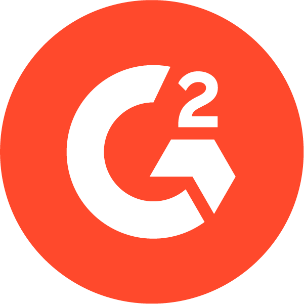

# G2

[Website](https://g2.com/) | [LinkedIn](https://www.linkedin.com/company/g2dotcom/posts/?feedView=all)

  

## 💼 My Experience

- Summer Internship: _Jun 2023 to Aug 2023_
- 6-month Internship: _Jan 2024 to Jun 2024_
- Assoc. Software Engineer: _Jul 2024 to Mar 2025_
- Software Engineer - I: _Apr 2025 to present_

## 🔑 Key Responsibilities

- Owned and executed day-to-day engineering work across tasks, tickets, bugs, and larger initiatives within core problem spaces - **Integrations (FY25)**, **ROI (FY26)**, and **Activations (FY27)**.
- Took responsibility for end-to-end delivery of features, from understanding requirements and design discussions to implementation, testing, and production rollout.
- Led cross-team communication during collaborative efforts, acting as a reliable point of contact to keep execution aligned and unblocked.
- Actively participated in code reviews, focusing on correctness, readability, and long-term maintainability.
- Regularly presented team progress and technical updates in company-wide showcases.
- Documented decisions, workflows, and new areas of the codebase to support knowledge sharing and smoother onboarding.
- Mentored interns and supported teammates through reviews, discussions, and informal guidance when needed.

## 📋 Noteworthy Contributions

### 🤖 AI-first (while holding on to the basics)

- Have been using **Claude Code** as a daily coding assistant for 6+ months.
- Took the initiative to create and maintain a company-wide GitHub repository for sharing Claude Code agents, slash commands, skills, and configurations, and actively contributed to it.
- I'm still a strong believer in the craft of software engineering. I've spent the last 2+ years building and refining my core fundamentals and engineering principles. I believe that engineers with a strong grasp of the basics and software engineering principles are the ones who can use genAI the best :)
  **Applying AI in production:**
- Combined AI with classical engineering to normalize dynamic, user-uploaded CSV data into our internal naming conventions, unblocking a critical workflow for users not using our native integrations.
- Built an interactive **AI Summary** feature to simplify a numbers-heavy dashboard, helping non-technical users understand complex metrics and ask meaningful follow-up questions.
- Revitalised a low-adoption feature (**Social Assets**) by introducing AI-based image generation, helping the project place **2nd** in the G2 Hackathon 2024.
- Built an automated **n8n** workflow (using Javascript + OpenAI) to summarise user-submitted survey feedback on our team’s page, running weekly and distilling dozens of responses into a clear, actionable summary shared with stakeholders on our Slack channel.

### 🎨 Front-end Engineering

**Tools & stack:** Slim HTML (with embedded Ruby), SCSS, Tailwind CSS, [`view_component_contrib`](https://github.com/palkan/view_component-contrib), Stimulus.js, Hotwire (Turbo)

- Took the initiative to run a design audit (by myself) on the **Integration Hub** page owned by our team, got it approved by our designer & implemented it in key sections to improve usability. The updated UX is still in use ~2 years later! This is something that gives me joy :)
- Contributed to the building of G2's new design system, a major shift in how we approached frontend development, by helping build shared components for the internal component library and actively participating in design and architecture discussions.
- Worked closely with designers throughout the build process, frequently collaborating on ideas and refining UX through joint brainstorming.
- Strong attention to visual detail; consistently translated designs into code with high fidelity to the original specs.

### 🏗️ Back-end Engineering

- Built a complete **Updates** feature early on (DB schema, admin-side CRUD, and user-facing UI) during my 2-month summer internship in 2023. #full-stack
- Implemented an auto-trigger mechanism for a site-wide notification system.
- Collaborated cross-functionally with the data team to set up an ETL pipeline (Snowflake × Airbyte × PostgreSQL) for user integrations, and built a **recommended integrations** feature on top of it.
- Independently conceived and built the **Preview ROI Dashboard** during a hackathon - a production feature showing aggregated real metrics (with obfuscation). Shipped end-to-end in one week with strong click-through and activation rates, and became one of the team’s better-performing features in FY 26. 💡
- Developed a core part of the **Sales Intelligence** tool, structuring complex backend business logic into a clean, principle-driven control flow.
- Built a CSV-based pipeline to match customers’ sales pipelines with prospect activity on G2, enabling value attribution. Handled end-to-end processing — parsing and normalising customer CSVs, inferring missing fields using **AI** based on available data, and robust edge-case handling — without compromising algorithmic accuracy. Optimised currency processing from ~3s to ~0.003s by identifying and caching static computations.
- Independently took-up a database refactoring effort: migrated JSONB fields to structured columns, automated data extraction, achieved **~2× query performance improvement**, and completed the rollout with zero downtime!

### 🤝 Volunteering & Community

- Gave a flash talk on _Documentation_ at **RubyConf 2024** | [Video](https://youtu.be/tIbyOA59Hxo?si=rdWcwAtn1B5EO1Be&t=2667)
- Actively contributed to two campus hiring drives, presenting to 300+ students across both years and independently conducting candidate interviews.
- Mentored interns, supporting them through onboarding and early project ownership.
- Consistently wrote and shared documentation when working on new or unfamiliar areas of the codebase.
- Put my hand up to represent the team in multiple company-wide presentations, sharing progress and technical insights, while my presentations gained a reputation for being very effective in visual communication.
- Conducting (on-going) a long-term mentorship on communication skills through the **G2 × [Veer Ratna Foundation](https://veerratna.org/)** partnership _(1+ year)_ | [A related LinkedIn post](https://www.linkedin.com/posts/veer-ratna-foundation_vrf-veerratnafoundation-livesleftbehind-activity-7403652062862807041-MJ_T?utm_source=social_share_send&utm_medium=member_desktop_web&rcm=ACoAAD2bKcQBWwKRJDtdhpuuLxC650b-Mi6vXX0)

### 🧠 Creative Problem Solving

- Revitalised a low-adoption feature (**Social Assets**) by introducing AI-based image generation, helping the project place **2nd** in the G2 Hackathon 2024.
- Built an automated **n8n** workflow (using Javascript + OpenAI) to summarise user-submitted survey feedback on our team’s page, running weekly and distilling dozens of responses into a clear, actionable summary shared with stakeholders on our Slack channel.
- Proposed and implemented a Slack-based **#pr-reviews** workflow during my internship, using emoji-triggered automations to streamline PR review requests across teams. The system is still the primary review mechanism ~2 years later.

### 🚀 Going the Extra Mile

- Contributed across three repositories beyond my primary ownership.
- Conducted a Git fundamentals session for incoming technical interns.

### 🎖️ Nominations & Awards

- Received the prestigious **MVP Award** in my first month as a full-time engineer | [LinkedIn](https://www.linkedin.com/posts/namskash_peak-activity-7246164293241462784-zFGC?utm_source=social_share_send&utm_medium=member_desktop_web&rcm=ACoAAD2bKcQBWwKRJDtdhpuuLxC650b-Mi6vXX0)
- Nominated 3 times for the **#PEAK Award**.
- Nominated for the **Beyond the Code** award.

### 📝 Documentation

- Authored and maintained multiple Confluence pages; documentation is a core part of how I work.
- Strong personal note-taking practice (Obsidian), which has helped accelerate learning and serve as a reliable reference for teammates.
