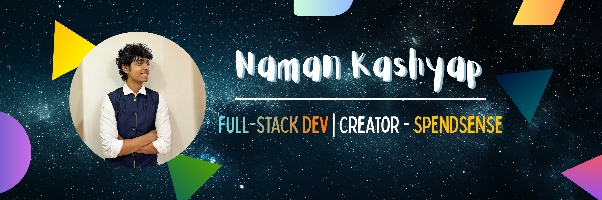

# Namaste! I'm Naman🙏

  

### 👨‍💻 About Me

- Learning is my favourite hobby :)
- Passionate about crafting clean, principle-driven backend + user-friendly, aesthetic frontend!
- Currently working in **Full-Stack Development**.
- I just published an _[Android App](https://play.google.com/store/apps/details?id=com.my.spendsense)_ on the Play Store after individually designing, architecting & developing it for ~2 years! [200+ downloads](https://play.google.com/store/apps/details?id=com.my.spendsense)

"_I use vim btw. Also, I daily-drive EndeavourOS & it's awesome!_" 🐧⌨️

### 💡 What I’m Working On

- **Work**: I work as a Full-Stack Dev at [G2](https://my.g2.com)! _(Since Jan '24)_ | [G2 Work Experience Summary](./Professional-Experience/G2.md)
- **Personal**: \[PUBLISHED] **SpendSense** – An Android App that allows you to track your daily spends! | [Google Play Store](https://play.google.com/store/apps/details?id=com.my.spendsense) | [GitHub](https://github.com/namskash/Spend-Sense) 📣

### ⚙️ My Stack

Languages/Frameworks/Tools I'm comfortable in:

-   
-     
-  
- 
-  
- 
-  
-  
-  

### ⚡Fun (Non-Tech) Facts About Me

- Trained Carnatic singer (13+ years) 🎤 | [Carnatic](https://youtube.com/playlist?list=PLmvol7EH9vMy_OxHNuTPKLf5FCHZ0NkrF&si=kOqpvTZjUs5fhYJG) | [A Song Cover](https://www.youtube.com/watch?v=mTCVyXUKwLU)
- I sketch & paint (12+ years) 🖌️ | [A time-lapse of a painting](https://youtu.be/G-Gll16_Vf8?si=qCtUyNggNeiZQEiV)
- Yakśagāna artist (17+ years) | [A live performance](https://www.youtube.com/watch?v=P6PS2xTRJS4&list=PLjWaDiwo2h1vstvmZKgI1MqpYhwfNBAtn)
- I can solve the Rubik's Cube in <12 seconds (10+ years) | [A 11.82s solve ;)](https://youtu.be/TBE4SGvfcCg?si=MyxkXqcapUIZ4iwz) | _P.S: My PB is 7.93s_
- Big Cricket fan. I occasionally play too 🏏
- Passionate about film-making, audio/video editing and song covers (10+ years) | [YouTube channel](https://www.youtube.com/NamanKashyap)
- Fitness enthusiast 🏃
- Intermediate Chess Player ♟️ _(in a past life)_
- Bad Badminton Player 🏸
- Astrophysics Nerd 🪐 | Grew up watching [Vsauce](https://www.youtube.com/@Vsauce), [Veritasium](https://www.youtube.com/@veritasium), [TED-Ed](https://www.youtube.com/@TEDEd) and I listen to [StarTalk](https://www.youtube.com/@StarTalk)

### 📑 Blog

- I write on [Medium](https://medium.com/@namskash) :)
- I dabble in both [technical](https://medium.com/@namskash/the-only-git-intro-youll-ever-need-77843dc4bbb6) and [non-technical](https://medium.com/@namskash/life-and-the-unrelenting-battle-with-entropy-513cb466a436) stuff.

### 📫 How to Reach Me

- [LinkedIn](https://www.linkedin.com/in/namskash/)
- <namskash@gmail.com>

<!--
**namskash/namskash** is a ✨ _special_ ✨ repository because its `README.md` (this file) appears on your GitHub profile.

Here are some ideas to get you started:

- 🔭 I’m currently working on ...
- 🌱 I’m currently learning ...
- 👯 I’m looking to collaborate on ...
- 🤔 I’m looking for help with ...
- 💬 Ask me about ...
- 📫 How to reach me: ...
- 😄 Pronouns: ...
- ⚡ Fun fact: ...
-->
